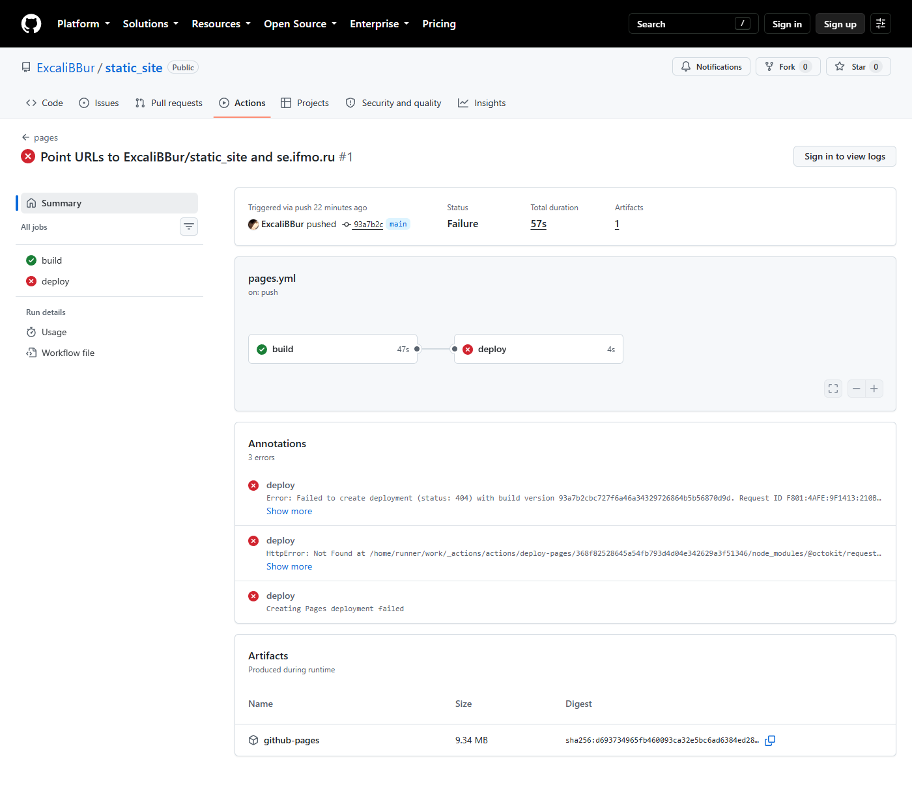
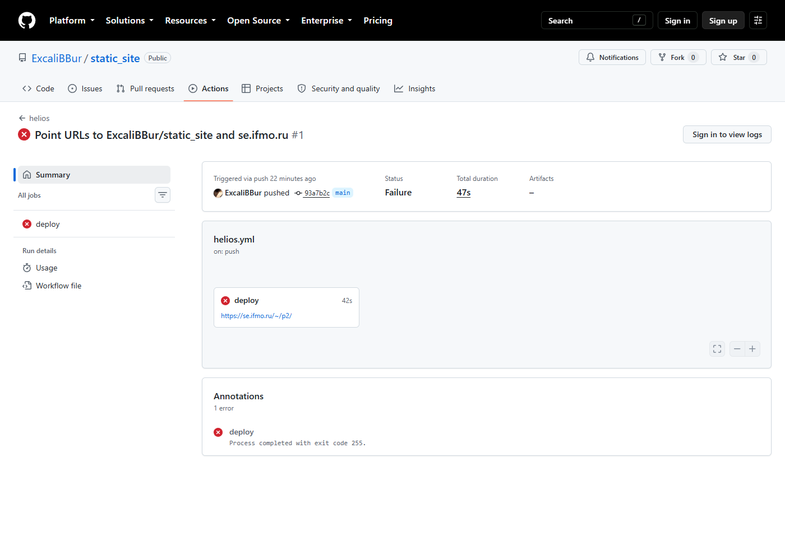

# Отладка

Ниже — ошибки, которые реально возникли при выполнении работы, в порядке
появления. Для каждой указаны текст ошибки или симптом, гипотеза, способ
проверки и решение.

## 1. Формулы в MkDocs выводятся сырым TeX

**Симптом.** На странице стресс-теста вместо формул виден текст
`\(\hat y = wx + b\)`; при этом нумерованные формулы (1) и (2) отрисованы.

**Гипотеза 1:** MathJax не загрузился (404 или обращение к CDN).
**Проверка:** вкладка Network — `assets/js/tex-svg.js → 200`;
в консоли `MathJax.version === "3.2.2"`. Гипотеза отвергнута.

**Гипотеза 2:** MathJax не распознаёт разделители `\( \)`, а формулы (1), (2)
отрисованы только потому, что `processEnvironments` находит
`\begin{equation}` без разделителей.
**Проверка:** в консоли `MathJax.config.tex.inlineMath` вернул
`[["(", ")"]]` — обратных слешей нет. Байтовый дамп файла
(`od -c mathjax-config.js`) показал `"\("` вместо `"\\("`: при записи файла
через heredoc оболочки удвоенный слеш превратился в одинарный, а в строке
JavaScript `"\("` — это просто `"("`.

**Решение.** Файл конфигурации переписан без участия оболочки, в нём
`inlineMath: [["\\(", "\\)"]]`. Добавлена автоматическая проверка в
`scripts/measure.py`: число элементов `.arithmatex` без отрисованного
`mjx-container` должно быть 0.

## 2. `mkdocs build --strict` падает на ссылке на якорь

**Текст ошибки:**

```text
WARNING -  Doc file 'p2/stress-test.md' contains a link
'../report/t5.md#1-постоянные-ссылки-и-стабильность-url', but the doc
'report/t5.md' does not contain an anchor '#1-постоянные-ссылки-и-стабильность-url'.
Aborted with 1 warnings in strict mode!
```

**Гипотеза:** якорь не существует (раздел ещё не написан) или генерируется
иначе, чем ожидается: стандартная функция `slugify` расширения `toc`
удаляет все не-ASCII символы, и кириллический заголовок получает пустой id.

**Проверка:** после написания раздела T5 сборка со стандартным `slugify`
выдала то же предупреждение; в HTML у заголовка
«1. Постоянные ссылки и стабильность URL» оказался `id="1-url"` —
кириллица вырезана. С `pymdownx.slugs.slugify(case=lower)` id стал
`1-постоянные-ссылки-и-стабильность-url`, т. е. совпал с GitHub-стилем,
который использует MyST (`myst_heading_anchors`), и сборка прошла.

**Решение.** В `mkdocs.yml` задан
`slugify: !!python/object/apply:pymdownx.slugs.slugify {kwds: {case: lower}}`;
одна и та же ссылка теперь работает в обоих генераторах.
Эта ошибка показывает, зачем в CI нужен `--strict`: без него сайт
собрался бы с битой ссылкой.

## 3. Сниппет метки версии не раскрывается

**Симптом.** Вместо метки «Коммит … · сборка …» на странице выводится
строка `--8<-- "build_info.md"`.

**Гипотеза:** `pymdownx.snippets` обрабатывает только строку, которая
**начинается** с `--8<--`, а в исходнике сниппет стоял внутри
`<p class="build-info">…</p>` на одной строке.

**Проверка:** перенос `--8<--` в начало отдельной строки внутри
`<div class="build-info" markdown>` — метка появилась.

**Решение.** Сниппет вынесен в отдельную строку внутри блока `md_in_html`.

## 4. Интерактивный график Plotly не растягивается на ширину колонки

**Симптом.** На странице MkDocs iframe с Plotly занимает узкую полосу по
центру (≈480 px из 882 px колонки), хотя у него `width: 100%`.

**Гипотеза 1:** тег `<figure>` в теме Material имеет ширину по содержимому
(`width: fit-content`), и 100 % ширины iframe считаются от неё.
**Проверка:** обёртка `<figure markdown>` заменена на `<div>`. Скриншот
не изменился — гипотеза в такой форме не подтвердилась.

**Гипотеза 2:** `<figure>` всё равно появляется: блок `/// figure-caption`
расширения `pymdownx.blocks.caption` оборачивает **предыдущий** элемент в
`<figure>` и добавляет `<figcaption>`.
**Проверка:** в консоли `document.querySelector('.plot-frame').closest('figure')`
вернул элемент, `getComputedStyle(figure).width` = `480px` при ширине
контента 882 px. Гипотеза подтверждена.

**Решение.** Одно правило CSS:
`.md-typeset figure:has(.plot-frame) { width: 100%; }`.
Сопутствующий вывод: ширину элементов проверять замером в DOM, а не на глаз
по скриншоту — первая «правка» лишь совпала с ожидаемым результатом в
узком окне.

## 5. Healthcheck падает с `UnicodeEncodeError` на Windows

**Текст ошибки:**

```text
File "...\encodings\cp1251.py", line 19, in encode
UnicodeEncodeError: 'charmap' codec can't encode character '→'
in position 16: character maps to <undefined>
```

**Гипотеза:** консоль Windows использует кодировку cp1251, в которой нет
символа «→» из сообщений скрипта.

**Проверка:** `python -c "import sys; print(sys.stdout.encoding)"` → `cp1251`.

**Решение.** В начале `main()` вызывается
`sys.stdout.reconfigure(encoding="utf-8")`. На раннере Ubuntu ошибка не
проявилась бы — это пример различия локальной и CI-среды.

## 6. Healthcheck не находит русское слово в индексе поиска MkDocs

**Симптом.** `FAIL MkDocs: search_index.json содержит слово 'градиентн…'`,
хотя поиск на сайте это слово находит.

**Гипотеза:** MkDocs сериализует индекс с `ensure_ascii=True`, и кириллица
хранится как `гр…`, поэтому поиск подстроки в сыром тексте
файла ничего не находит.

**Проверка:** `head -c 300 public/search/search_index.json` — строки
состоят из `\uXXXX`.

**Решение.** Файл разбирается `json.loads`, поиск идёт по полю `text`
каждого документа.

## 7. `scripts/measure.py` не попадает в репозиторий

**Симптом.** После `git add -A` файл отсутствует в `git status`.

**Гипотеза:** шаблон `measure.py` в `.gitignore` (для старого черновика в
корне) без ведущего `/` совпадает с файлом на любой глубине.

**Проверка:** после замены шаблона на `/measure.py` повторный `git add -A`
добавил `scripts/measure.py` в индекс, а файл черновика в корне остался
игнорируемым.

**Решение.** Шаблоны для файлов черновика привязаны к корню: `/measure.py`,
`/mkdocs/`, `/sphinx/` и т. д.

## 8. Внешние запросы у MkDocs при «полностью локальном» сайте

**Симптом.** Тест в режиме «без CDN» показал 2 заблокированных запроса у
MkDocs, хотя MathJax, Plotly и шрифты локальные.

**Гипотеза:** запросы делает тема, а не контент.

**Проверка:** в журнале запросов Playwright — два обращения к
`api.github.com/repos/ExcaliBBur/static_site`; их инициирует компонент
«source» темы Material, если задан `repo_url`.

**Решение.** Оставлено сознательно: запрос необязателен (без него не
показывается только число звёзд), страница полностью работает. Для
«строгой» автономности достаточно убрать `repo_url` из `mkdocs.yml`.

## 9. `mkdocs-bibtex` находит «цитату» внутри inline-кода

**Текст ошибки** (при добавлении отчёта в сайт MkDocs):

```text
WARNING -  Citing unknown reference key key
WARNING -  Error formatting citation key into footnote format {key}
Aborted with 2 warnings in strict mode!
```

**Гипотеза:** в тексте отчёта по P2 синтаксис цитирования был показан как
пример в обратных кавычках: открывающая скобка, «собака», слово key,
закрывающая скобка. Плагин ищет цитаты регулярным выражением по исходному
Markdown **до** его разбора и не знает, что это фрагмент кода.

**Проверка:** поиск `grep` по подстроке «скобка + собака» в `report/*.md`
нашёл единственное вхождение в `report/p2.md`; ключа `key` в `.bib` нет.
Первая попытка описать ошибку в этом разделе снова уронила сборку
(`Inline reference to unknown key key`): при включённых inline-цитатах
плагин реагирует даже на «собаку» перед словом без скобок.

**Решение.** Пример переписан словами. Ограничение плагина отмечено в
сравнении P2: в Sphinx роль `{cite:p}` разбирается парсером и внутри кода
не срабатывает.

## 10. Первый деплой на GitHub Pages: `status: 404`

**Текст ошибки** (аннотация job `deploy`, шаг `actions/deploy-pages`):

```text
Error: Failed to create deployment (status: 404) with build version 93a7b2c…
Ensure GitHub Pages has been enabled: https://github.com/ExcaliBBur/static_site/settings/pages
HttpError: Not Found … at createPagesDeployment (…/deploy-pages/…/src/internal/api-client.js:125:1)
```

Job `build` при этом прошёл полностью, включая healthcheck собранного сайта.

**Гипотеза:** в репозитории не включён GitHub Pages: API создания
Pages-деплоя отвечает 404, пока сайт Pages не создан.

**Проверка:** `GET https://api.github.com/repos/ExcaliBBur/static_site`
вернул `"has_pages": false`, а `GET …/pages` — `404 Not Found`.

**Решение.** Settings → Pages → Source = **GitHub Actions**, затем
повторный запуск workflow. Ошибка показывает, что проваленный deploy не
портит уже опубликованный сайт: артефакт собран, но не выложен.



*Проваленный запуск `pages`: job `build` успешен, `deploy` упал на `deploy-pages`.*

## 11. Первый запуск `helios`: `exit code 255`

**Текст ошибки:** шаг `Deploy with rsync` — `Process completed with exit code 255.`

**Гипотеза:** код 255 возвращает `ssh`, а не `rsync` (у rsync свои коды
1–35): соединение не установилось. Секреты `HELIOS_SSH_KEY` и
`HELIOS_KNOWN_HOSTS` к этому моменту ещё не были заданы — в файл ключа
записалась пустая строка.

**Проверка:** шаг `Configure SSH` завершился успешно (пустой секрет —
не ошибка для `printf`), падает первый шаг, который реально идёт в сеть.

**Решение.** Секреты добавлены в Settings → Secrets and variables →
Actions. Вывод для workflow: стоит явно проверять, что секрет не пуст
(`test -n "$SSH_KEY"`), чтобы ошибка указывала на причину, а не на
следствие.



*Проваленный запуск `helios`: rsync завершился кодом 255 (нет ключа).*

## 12. Lighthouse: FCP 9,5 с у MkDocs на мобильном профиле

**Симптом.** Первый запуск Lighthouse (workflow `lighthouse`, мобильный
профиль с эмуляцией медленного 4G): MkDocs — `performance=40`,
`first-contentful-paint=9.5 s`; Sphinx на той же странице — 71 и 1,0 с,
хотя вес страниц почти одинаков (≈2,3 МиБ передано у обоих).

**Гипотеза:** MathJax (`tex-svg.js`, 2 МиБ, 662 КиБ gzip) подключён в
MkDocs синхронным `<script>`, и браузер не рисует страницу, пока не
загрузит и не выполнит его. У Sphinx тот же файл подключён с `defer`.

**Проверка:** в собранном HTML

```text
MkDocs: <script src="../assets/js/tex-svg.js">
Sphinx: <script defer="defer" src="../_static/mathjax/tex-svg.js?v=50970ec6">
```

**Решение.** В `mkdocs.yml` для обоих скриптов MathJax задано
`defer: true` (формат `extra_javascript` с `path:` поддерживается с
MkDocs 1.5). Порядок выполнения `defer`-скриптов сохраняется, поэтому
конфигурация применяется до загрузки MathJax; автоматическая проверка
`measure.py` подтвердила, что все формулы по-прежнему отрисованы.
Результат повторного замера — в P2, § 3.3.

## 13. Замеры упёрлись в лимиты API

**Симптомы.**

```text
PageSpeed Insights: 429 Quota exceeded for quota metric 'Queries' and
limit 'Queries per day' of service 'pagespeedonline.googleapis.com'
GitHub API:         HTTP Error 403: rate limit exceeded
```

**Гипотеза:** оба API вызывались без ключа. У PageSpeed Insights запросы
без ключа идут в общую суточную квоту, исчерпанную другими пользователями;
у GitHub API без токена лимит — 60 запросов в час на IP, и цикл ожидания
завершения workflow (опрос каждые 15 с) исчерпал его за 15 минут.

**Проверка:** тело ответа PSI явно называет квоту «Queries per day»;
заголовок `X-RateLimit-Remaining: 0` у ответа GitHub.

**Решение.** Lighthouse перенесён в CI: отдельный workflow `lighthouse`
запускается после успешного `pages` (`workflow_run`) и выполняет
`npx lighthouse@13.5.0` в Chrome раннера; результаты выводятся
аннотациями, которые видны на публичной странице запуска. Ожидание
завершения workflow переведено на чтение публичной веб-страницы Actions
раз в 30 с (`scripts/wait_run.py`), на неё лимит API не распространяется.

## 14. Ссылки на формулы синие после смены палитры

**Симптом.** После перехода на собственную палитру ссылки `\eqref` на
формулы «(1)», «(2)» в MkDocs остались синими; в тёмной теме они почти не
видны. Первая попытка — правило `.md-typeset mjx-container a *
{ fill: … }` — закрасила ссылки сплошными прямоугольниками.

**Гипотеза 1:** прямоугольники — это невидимая «зона клика» (`<rect>`),
которую MathJax кладёт внутрь ссылки; правило с `*` закрасило и её.
**Проверка:** в DOM внутри `<a>` есть `<rect>`; после `a rect { fill: none }`
прямоугольники исчезли.

**Гипотеза 2:** цвет глифов задаёт сам MathJax правилом
`mjx-container[jax="SVG"] a { fill: blue; stroke: blue }`, вставленным в
страницу после наших стилей; при равной специфичности побеждает последнее.
**Проверка:** `getComputedStyle(a).color` уже малиновый, а глифы синие.

**Решение.** Селектор с большей специфичностью
`.md-typeset mjx-container[jax="SVG"] a { fill; stroke; color }` — ссылки
малиновые в светлой и розовые в тёмной теме.
