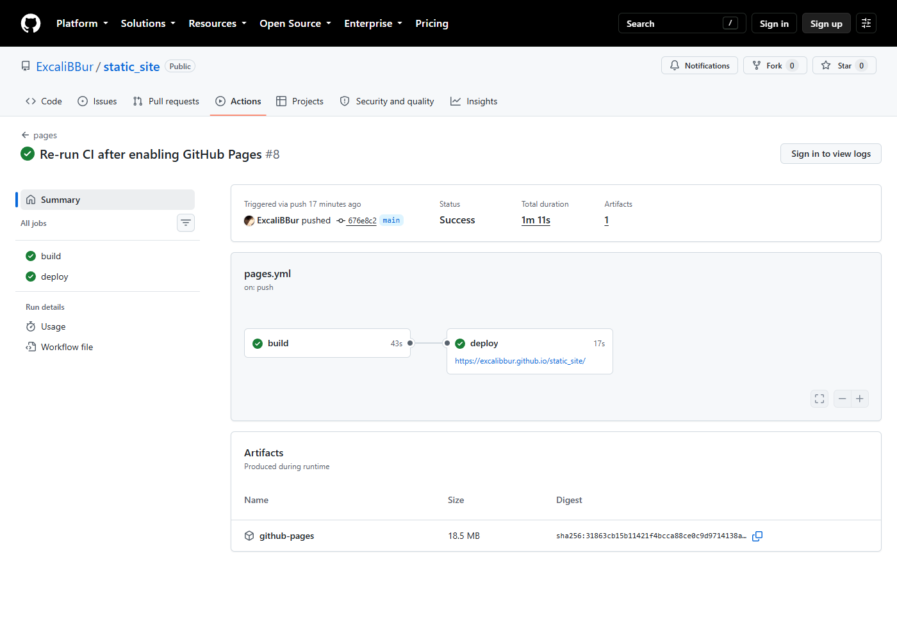
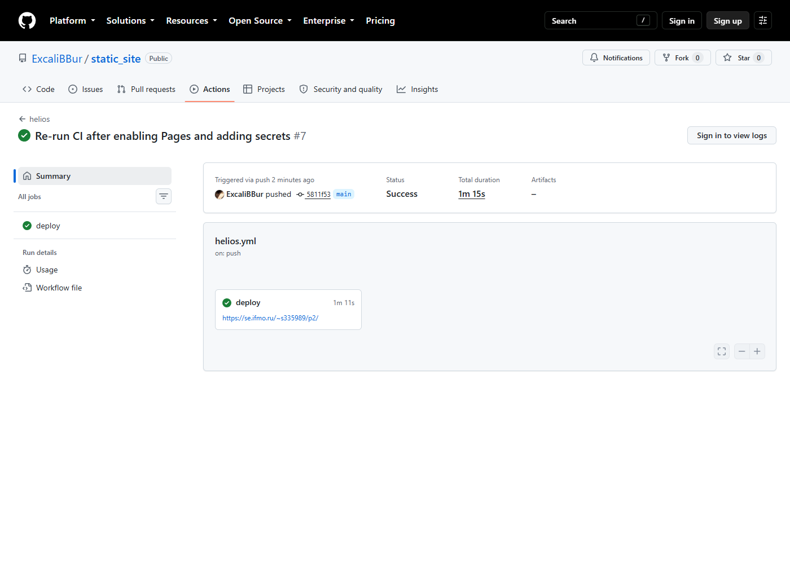
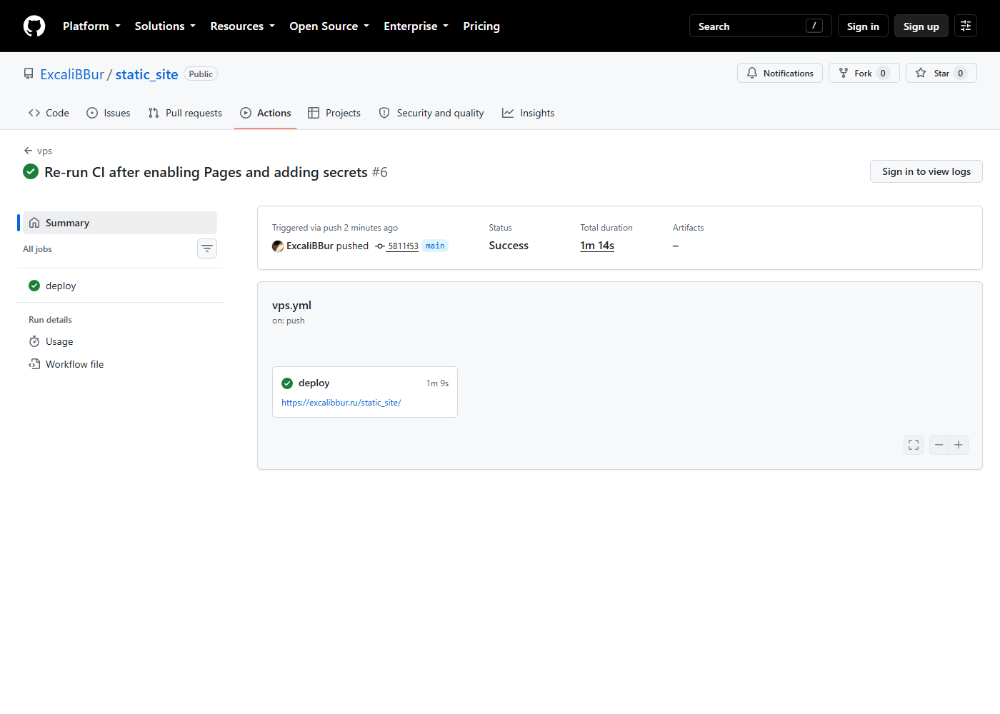
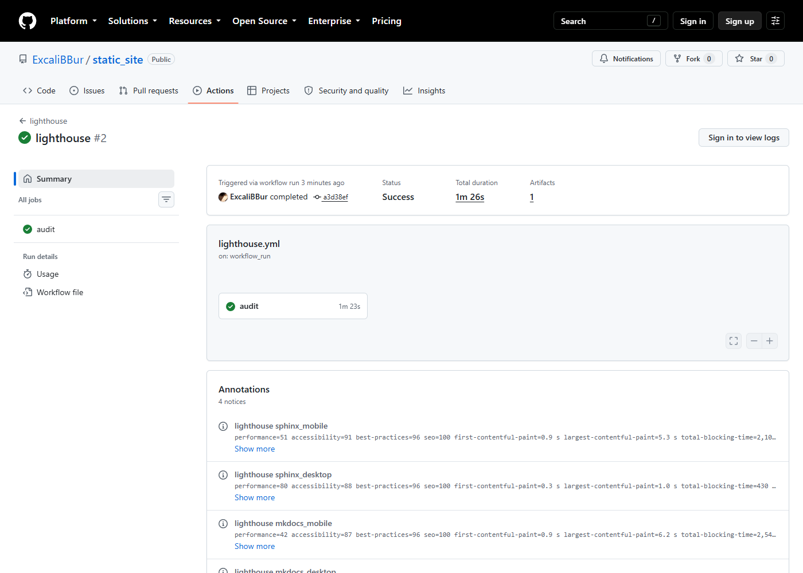
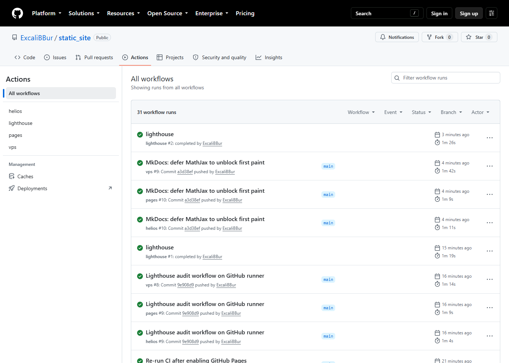

# Ход работы

Отчёт целиком: [static_site_report.docx](static_site_report.docx) (Word) ·
[static_site_report.pdf](static_site_report.pdf) (PDF). Тот же текст
опубликован на страницах раздела «Отчёт» обоих сайтов.

## Ссылки

| Ресурс | Адрес |
|---|---|
| Репозиторий | <https://github.com/ExcaliBBur/static_site> |
| GitHub Pages — MkDocs + Material | <https://excalibbur.github.io/static_site/> |
| GitHub Pages — Sphinx + MyST | <https://excalibbur.github.io/static_site/sphinx/> |
| Helios ИТМО | <https://se.ifmo.ru/~s335989/p2/> |
| Собственный VPS (excalibbur.ru) | <https://excalibbur.ru/static_site/> |
| Запуски CI | <https://github.com/ExcaliBBur/static_site/actions> |

## 1–2. Python, pip, virtualenv

| Компонент | Версия | Команда проверки |
|---|---|---|
| Python | 3.13.3 | `python --version` |
| pip | 25.0.1 | `pip --version` |
| virtualenv | 21.13.0 | `python -m virtualenv --version` |
| ОС | Windows 11 Pro (локально), Ubuntu 24.04 (раннер CI) | — |

`virtualenv` отсутствовал и был установлен командой
`python -m pip install --user virtualenv`.

## 3. Каталог проекта и виртуальное окружение

```bash
python -m virtualenv .venv
.venv/Scripts/activate            # Linux/macOS: source .venv/bin/activate
```

## 4. Фиксация зависимостей и `.gitignore`

Выбран `requirements.txt` с точными версиями (`==`): для двух генераторов
и скрипта подготовки контента это проще lock-файла `uv`/`poetry`, а на
чистом раннере даёт ту же воспроизводимость в связке с точной версией
Python (`python-version: "3.13.3"` в workflow).

| Файл | Назначение |
|---|---|
| `requirements.txt` | всё, что нужно для сборки сайта (15 пакетов с точными версиями) |
| `requirements-dev.txt` | дополнительно: Playwright (замеры P2), python-docx (отчёт) |
| `.gitignore` | `.venv/`, `site/`, `_build/`, `public/`, `__pycache__/`, `.cache/` и все сгенерированные файлы (графики, копии отчёта и MathJax внутри сайтов) |
| `.gitattributes` | `eol=lf`: одинаковые окончания строк на Windows и в CI |

## 5. Установка генераторов и каркас сайтов

```bash
pip install -r requirements.txt
```

Структура репозитория:

```text
data/                 набор данных эксперимента + метаданные (версия, sha256)
report/               текст отчёта — общий Markdown для обоих генераторов
scripts/prepare.py    данные → расчёт → графики, таблица, метка версии
scripts/build_all.py  prepare → mkdocs --strict → sphinx -W → public/
scripts/check_site.py healthcheck опубликованного сайта
scripts/measure.py    замеры P2
scripts/build_docx.py этот отчёт в формате Word
site-mkdocs/          MkDocs + Material (основной сайт, публикуется в корень)
site-sphinx/          Sphinx + MyST + Furo (публикуется в /sphinx/)
vendor/mathjax/       локальная копия MathJax 3.2.2
.github/workflows/    pages.yml, helios.yml, vps.yml
```

Отчёт хранится один раз в `report/` и при каждой сборке копируется
скриптом `prepare.py` в оба сайта, поэтому текст на сайтах MkDocs и Sphinx
и в документе Word совпадает. Для этого в отчёте используется только общее
подмножество Markdown (заголовки, таблицы, списки, код, изображения),
которое одинаково понимают Python-Markdown и MyST.

## 6. Локальная сборка

```bash
python scripts/prepare.py
cd site-mkdocs && mkdocs serve          # предпросмотр с автообновлением
mkdocs build --strict                   # предупреждение = ошибка
cd ../site-sphinx && sphinx-build -W -b html . _build/html
python scripts/build_all.py             # всё вместе → public/
```

В `mkdocs.yml` включена проверка ссылок и якорей
(`validation.anchors: warn`), поэтому `--strict` ловит и битые ссылки на
разделы других страниц. Сработавшие на практике случаи описаны в разделе
«Отладка» (ошибки 2 и 9).

## 7. Репозиторий на GitHub

```bash
git init -b main
git remote add origin https://github.com/ExcaliBBur/static_site.git
git push -u origin main
```

## 8. GitHub Actions и GitHub Pages

В настройках репозитория Pages → Source переключён на **GitHub Actions**.
Workflow `pages.yml` состоит из двух job:

| Job | Триггер | Что делает | Права |
|---|---|---|---|
| `build` | push в `main`, pull request, ручной запуск | установка зависимостей с кэшем pip → `build_all.py` (строгий режим) → healthcheck собранного сайта на локальном сервере → `upload-pages-artifact` | `contents: read` |
| `deploy` | только push в `main` | `deploy-pages` → healthcheck опубликованного URL с проверкой хеша коммита | `pages: write`, `id-token: write` |

Сравнение двух подходов к публикации:

| Критерий | push в ветку `gh-pages` (`peaceiris/actions-gh-pages`) | `upload-pages-artifact` + `deploy-pages` |
|---|---|---|
| Где хранится сайт | отдельная ветка с собранным HTML в самом репозитории | артефакт workflow (tar), ветки нет |
| Нужные права токена | `contents: write` — запись во **весь** репозиторий | `pages: write` + `id-token: write`, записи в репозиторий нет |
| Последствия компрометации шага | можно изменить код в любой ветке | можно только опубликовать другой сайт |
| Сторонний код в цепочке | action стороннего автора | только официальные actions GitHub |
| История версий сайта | есть (коммиты в `gh-pages`), откат — `git revert` | нет; откат — повторный запуск старого workflow |
| Размер репозитория | растёт с каждой публикацией | не меняется |
| Environment с правилами защиты | нет | да (`github-pages`) |
| Работает с другими хостингами | ветку можно зеркалировать куда угодно | только GitHub Pages |

Выбрана официальная связка: меньше прав, нет стороннего кода,
репозиторий не разрастается.

Все actions зафиксированы **по SHA коммита** с тегом в комментарии
(`actions/checkout@3d3c42e… # v7.0.1`): тег можно перенести на другой
коммит, SHA — нет.

## 9. Учётные записи на отечественных площадках

| Площадка | Доступ | Адрес сайта |
|---|---|---|
| Helios ИТМО | учётная запись `s335989`, SSH `se.ifmo.ru:2222`, FreeBSD 14.5, nginx 1.30 | `~/public_html/p2/` → <https://se.ifmo.ru/~s335989/p2/> |
| Собственный VPS | `excalibbur.ru`, Ubuntu 24.04, Nginx Proxy Manager в Docker | `/root/npm/data/static_site/` → <https://excalibbur.ru/static_site/> |

Для каждой площадки создан **отдельный deploy-ключ** ed25519 (не личный
ключ разработчика):

| Площадка | Строка в `authorized_keys` | Что может злоумышленник с этим ключом |
|---|---|---|
| Helios | `restrict,command="/usr/local/sbin/rrsync /home/studs/s335989/public_html/p2/" ssh-ed25519 …` | только rsync внутри `public_html/p2` |
| VPS | `restrict,command="/usr/bin/rrsync /root/npm/data/static_site/" ssh-ed25519 …` | только rsync внутри каталога сайта |

`restrict` запрещает pty, форвардинг портов и агента, а принудительная
команда `rrsync` пропускает только rsync и только в указанный каталог.
Проверка — попытка выполнить команду с deploy-ключом:

```text
$ ssh -i helios_deploy -p 2222 s335989@se.ifmo.ru 'ls /'
/usr/local/sbin/rrsync error: SSH_ORIGINAL_COMMAND does not run rsync
```

Первоначально ключ Helios был добавлен только с `restrict` (полный
доступ к учётной записи студента) в предположении, что `rrsync` на
FreeBSD-сервере нет; проверка `which rrsync` показала обратное, и ключ
был ограничен так же, как на VPS.

Ключи хостов для `known_hosts` получены через `ssh-keyscan` и **сверены с
отпечатками из уже доверенного локального `~/.ssh/known_hosts`**
(ED25519 `SHA256:3n1x6Bq0…` для Helios, `SHA256:MH9WzKIF…` для VPS).
В CI `known_hosts` берётся из секрета, проверка ключа хоста не отключается
(`StrictHostKeyChecking=yes`).

## 10. Workflow для отечественных площадок

`helios.yml` и `vps.yml` отличаются от `pages.yml` способом доставки: вместо
артефакта Pages — `rsync` по SSH.

| Секрет / переменная | Где используется | Содержимое |
|---|---|---|
| `HELIOS_SSH_KEY` | helios.yml | приватный deploy-ключ Helios |
| `HELIOS_KNOWN_HOSTS` | helios.yml | `[se.ifmo.ru]:2222 ssh-ed25519 …` |
| `HELIOS_USER` (variable) | helios.yml | `s335989` |
| `VPS_SSH_KEY` | vps.yml | приватный deploy-ключ VPS |
| `VPS_KNOWN_HOSTS` | vps.yml | `excalibbur.ru ssh-ed25519 …` |

Ключевой шаг доставки:

```bash
rsync -rlz --checksum --delete-after --delay-updates --chmod=D755,F644 \
  -e "ssh -p 2222 -i ~/.ssh/helios -o StrictHostKeyChecking=yes -o IdentitiesOnly=yes" \
  public/ "s335989@se.ifmo.ru:./"      # "./" = каталог, заданный rrsync на сервере
```

`--delay-updates` складывает новые файлы во временные имена и переименовывает
их в конце, а `--delete-after` удаляет старые файлы только после передачи —
при обрыве соединения на сервере остаётся прежняя целостная версия сайта,
а не смесь двух.

На VPS для отдачи каталога добавлен файл
`/root/npm/data/nginx/custom/server_proxy.conf`, который Nginx Proxy Manager
штатно подключает в `server` хоста `excalibbur.ru`:

```nginx
location = /static_site { return 301 /static_site/; }
location ^~ /static_site/ {
    alias /data/static_site/;
    index index.html;
    error_page 404 /static_site/404.html;
    gzip on;
    gzip_min_length 1024;
    gzip_types text/css application/javascript application/json image/svg+xml text/xml;
    add_header X-Content-Type-Options nosniff;
}
```

Полные тексты workflow с комментариями приведены в приложении.

## 11. Базовый URL

| Параметр | Значение | Зачем |
|---|---|---|
| `site_url` (MkDocs) | из переменной `SITE_URL`: свой для каждой площадки | канонический URL, `sitemap.xml`, пути в `404.html` |
| `html_baseurl` (Sphinx) | `SITE_URL + "sphinx/"` | `sitemap.xml`, `og:url` |
| `use_directory_urls` | `false` | страницы вида `report/t5.html`: относительные ссылки из сырого HTML (iframe) работают одинаково из корня, из подкаталога `/~s335989/p2/` и при открытии файла с диска |

Типичная ошибка из задания воспроизведена и проверена: обычные страницы
MkDocs ссылаются на ресурсы относительными путями и работают из любого
подкаталога, но **`404.html` использует абсолютные пути от `site_url`**:

| Сборка | Ссылка на CSS в `404.html` |
|---|---|
| `SITE_URL=http://127.0.0.1:8000/` | `/assets/stylesheets/main.ec1eaa64.min.css` |
| `SITE_URL=https://se.ifmo.ru/~s000000/p2/` | `/~s000000/p2/assets/stylesheets/main.ec1eaa64.min.css` |

Поэтому каждая площадка собирается со своим `SITE_URL` (задан в
соответствующем workflow), а не с адресом GitHub Pages.

## 12. Проверка результата развёртывания

Скрипт `scripts/check_site.py` запускается после каждого деплоя и
завершает job с ошибкой при любом несоответствии:

| Проверка | Как проверяется |
|---|---|
| HTTP 200 | главная, страница P2 и T5 в MkDocs и Sphinx |
| Контрольная строка | `p2-site-ok` в HTML главной |
| Версия | метка сборки содержит хеш текущего коммита (ожидание до 3 минут для CDN GitHub Pages) |
| Поиск | `search/search_index.json` MkDocs содержит слово «градиентн…»; `searchindex.js` Sphinx доступен |
| Формулы без CDN | `tex-svg.js` и `plotly.min.js` отдаются с того же хоста; в `<script src>`/`<link href>` нет CDN-хостов |
| `sitemap.xml` | доступен у обоих генераторов |

Результаты ручного запуска на отечественных площадках:

| Площадка | Результат `check_site.py` | Время загрузки сайта (22 МБ, 136 файлов) | Сжатие | Своя страница 404 |
|---|---|---:|---|---|
| Helios (`tar` по SSH) | все проверки пройдены | 43,6 с | нет (`plotly.min.js` 4,7 МиБ) | нет (страница nginx) |
| VPS (`tar` по SSH) | все проверки пройдены | 50,9 с | gzip (`plotly.min.js` 1,7 МиБ) | да |

Отображение формул при недоступных CDN дополнительно проверено в браузере:
все внешние запросы блокировались, MathJax отрисовал все формулы (P2, § 3.4).

### Результаты CI

Все три workflow запускаются на каждый push в `main`. Длительность шагов
взята из API GitHub Actions для одного и того же коммита `676e8c2`
(первый полностью зелёный прогон).

| Шаг | pages: build | pages: deploy | helios | vps |
|---|---:|---:|---:|---:|
| checkout + setup-python (с восстановлением кэша pip) | 13 с | — | 12 с | 14 с |
| `pip install -r requirements.txt` | 16 с | — | 19 с | 19 с |
| Сборка MkDocs + Sphinx (`--strict`, `-W`) | 5 с | — | 5 с | 5 с |
| Healthcheck собранного сайта (локально) | 2 с | — | — | — |
| Доставка | 2 с (upload-artifact) | 7 с (deploy-pages) | 3 с (rsync) | 5 с (rsync) |
| Healthcheck опубликованного сайта | — | 2 с | 18 с | 22 с |
| **Job целиком** | **43 с** | **17 с** | **62 с** | **70 с** |

Сравнение площадок по доставке:

| Критерий | GitHub Pages | Helios | VPS |
|---|---|---|---|
| Время от push до обновлённого сайта | ≈ 70 с (build 43 с + ожидание очереди + deploy 17 с) | ≈ 65 с | ≈ 75 с |
| Собственно доставка | 7 с | 3 с | 5 с |
| Протокол | HTTPS API GitHub (OIDC) | SSH + rsync, порт 2222 | SSH + rsync, порт 22 |
| Инкрементальность | нет (весь артефакт) | да (`--checksum`: только изменённые файлы) | да |
| Healthcheck с раннера GitHub | 2 с | 18 с | 22 с |
| Поведение при обрыве | деплой атомарный: старая версия остаётся | `--delay-updates` + `--delete-after`: старая версия до конца передачи | то же |
| Отладка | логи только у владельца, аннотации публичны | можно зайти по SSH своим ключом и посмотреть файлы | то же + логи nginx |

Healthcheck отечественных площадок занимает 18–22 с против 2 с у GitHub
Pages: раннеры GitHub находятся за рубежом, а скрипт скачивает
`plotly.min.js` и `tex-svg.js` с сервера целиком. Кэш pip почти не
ускоряет установку (20 с без кэша в первом прогоне против 16–19 с с кэшем):
кэшируются только скачанные колёса, а основное время уходит на установку
(распаковку и компиляцию байткода) numpy, matplotlib и plotly.

Первые прогоны были красными — это ожидаемые ошибки конфигурации,
разобранные в разделе «Отладка» (№ 10, 11): Pages не был включён,
секреты не были заданы.



*Успешный запуск `pages`: build и deploy.*



*Успешный запуск `helios`: сборка, rsync на Helios, healthcheck.*



*Успешный запуск `vps`: сборка, rsync на VPS через rrsync, healthcheck.*



*Запуск `lighthouse` после публикации: оценки выводятся аннотациями (P2, § 3.3).*



*Список запусков workflow в репозитории.*


## 13. Лицензии

| Объект | Лицензия | Файл |
|---|---|---|
| Текст, рисунки, таблицы | CC BY 4.0 | `LICENSE-CONTENT` |
| Код | MIT | `LICENSE` |
| Данные | CC0 1.0 | `data/LICENSE` |
| MathJax (вендорная копия) | Apache 2.0 | `vendor/mathjax/LICENSE` |

Сведения для цитирования — `CITATION.cff`. На сайтах есть страница
«Лицензии» и машиночитаемая ссылка `<link rel="license">`.

## 14. Отладка

Все ошибки, возникшие при выполнении работы, описаны в разделе
[«Отладка»](debugging.md).
