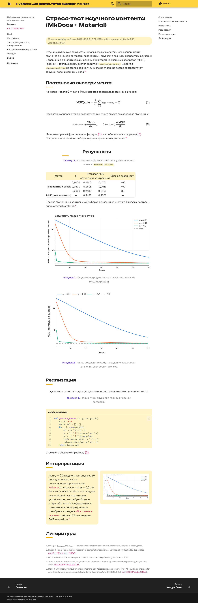
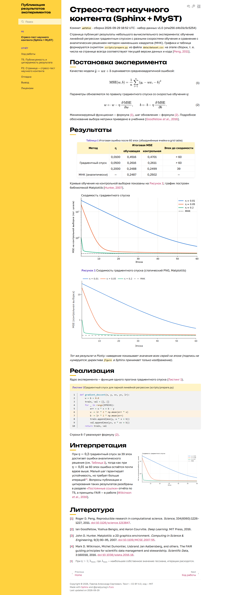
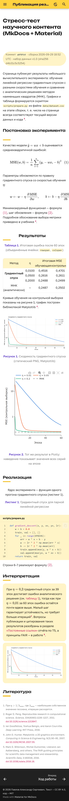
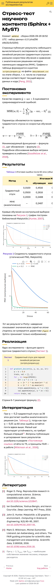

# P2. Страница — стресс-тест научного контента

## 1. Постановка

Одна и та же страница свёрстана на двух генераторах из T1:

| Генератор | Версии | Тема и расширения |
|---|---|---|
| **MkDocs + Material** | MkDocs 1.6.1, Material 9.7.7 | `pymdownx` 12.1 (arithmatex, highlight, snippets, blocks.caption), `mkdocs-bibtex` 4.4.0 |
| **Sphinx + MyST** | Sphinx 9.1.0, MyST-Parser 5.1.0 | тема Furo, `sphinxcontrib-bibtex` 2.7.0, `sphinx-design` 0.7.0, `sphinx-sitemap`, `sphinxext-opengraph` |

Содержимое страницы — результаты небольшого эксперимента: линейная регрессия,
обученная градиентным спуском с тремя скоростями обучения, и аналитическое
решение МНК. Числа, графики и таблица не вписаны вручную, а формируются
скриптом `scripts/prepare.py` из `data/dataset.csv` при каждой сборке.
Скрипт выдаёт один и тот же результат в двух форматах, которые понимает
каждый генератор (HTML-таблица для MkDocs, grid table reStructuredText для
Sphinx).

**Оформление.** Стандартный вид тем (синяя шапка Material, серый Furo)
заменён собственным, одинаковым для обоих генераторов и без форка тем:

| | MkDocs + Material | Sphinx + Furo |
|---|---|---|
| Палитра | `primary: custom`, `accent: custom` + CSS-переменные Material в `assets/css/theme.css` | `html_theme_options` → `light_css_variables` / `dark_css_variables` |
| Светлая тема | жёлтая шапка, малиновые ссылки, тёплые подсветки таблиц и кода | жёлтый сайдбар и мобильная шапка, те же акценты |
| Тёмная тема | фиолетово-графитовая, жёлтый текст шапки, розовые ссылки | то же |
| Шрифты | Golos Text (текст) и Unbounded (заголовки), кириллица, лицензия OFL; файлы `woff2` лежат в сайте (`vendor/fonts`, 139 КиБ), Google Fonts не используется | те же, через `font-stack` и `font-stack--headings` Furo |

Страницы:
[MkDocs](../p2/stress-test.md) ·
Sphinx — `sphinx/p2/stress-test.html` на том же сайте.

## 2. Обязательный состав страницы и способ реализации

| Элемент | MkDocs + Material | Sphinx + MyST |
|---|---|---|
| Нумерованная формула + ссылка из текста | `\begin{equation}…\label{eq:mse}` + `\eqref{eq:mse}`; нумерует MathJax (`tags: "ams"`) **в браузере** | директива `{math}` с `:label:` + роль `{eq}`; номер присваивает Sphinx **при сборке** |
| Таблица с объединёнными ячейками и подписью | сырой HTML (`rowspan`/`colspan`), подпись — `/// table-caption` с автонумерацией | grid table rST внутри `{eval-rst}`, директива `table` с `:name:`, ссылка `{numref}` |
| Статический график (Matplotlib) | Markdown-изображение + `/// figure-caption` | директива `{figure}` с `:name:` |
| Интерактивный график (Plotly) | `<iframe>` на HTML, сгенерированный Plotly; `plotly.min.js` лежит рядом | то же через `{raw} html` |
| Листинг с подсветкой и номерами строк | `linenums="1"` + `title=` (pymdownx.highlight) | `{code-block}` с `:linenos:`, `:caption:`, `:emphasize-lines:` |
| Цитирование из `.bib` + список литературы | плагин `mkdocs-bibtex`: ключ с «собакой» в квадратных скобках → сноска, маркер `\bibliography` | `sphinxcontrib-bibtex`: `{cite:p}` → «[Автор, год]», директива `{bibliography}` |
| Двухколоночный блок | `
` + 6 строк CSS | `::::{grid} 1 1 2 2` (sphinx-design) |
| Сноска | `[^lr]` (расширение `footnotes`) | `[^lr]` (встроено в MyST) |
| Перекрёстная ссылка на другой раздел | `[текст](../report/t5.md#якорь)`, существование якоря проверяет `--strict` | та же Markdown-ссылка (`myst_heading_anchors = 3`) или `{ref}` |

## 3. Измерения

Условия: Windows 11, Python 3.13.3, Chrome (Playwright 1.63, канал `chrome`),
локальный сервер `http.server` без сжатия. Скрипт — `scripts/measure.py`,
сырые данные — `report/measurements.json`.

### 3.1. Время сборки и объём результата

Холодная сборка — каталог результата удалён; инкрементальная — повторный
запуск без изменений исходников. По 3 запуска, время подготовки контента
(`prepare.py`, ≈1,0 с, общее для обоих) не включено. Сайт содержит
8 страниц MkDocs / 8 документов Sphinx, включая полный текст этого отчёта
со скриншотами и файлами `.docx`/`.pdf`.

| Показатель | MkDocs + Material | Sphinx + MyST |
|---|---:|---:|
| Холодная сборка, запуски, с | 1,04 / 1,02 / 1,00 | 2,46 / 2,38 / 2,41 |
| Холодная сборка, среднее, с | **1,02** | **2,42** |
| Инкрементальная сборка, запуски, с | 1,02 / 1,02 / 1,03 | 2,70 / 1,60 / 1,68 |
| Инкрементальная сборка, среднее, с | **1,02** | **1,99** |
| Объём каталога результата, МиБ | 12,87 | 11,41 |
| Число файлов | 82 | 82 |

MkDocs не имеет настоящей инкрементальной сборки (каждый раз пересобираются
все страницы), но на 8 страницах это всё равно быстрее Sphinx: у Sphinx
инкрементальная сборка пересобирает только изменённые документы, но
запуск (импорт расширений, чтение окружения, копирование статики,
sitemap) занимает ≈1,5 с. Первый запуск в каждой серии медленнее из-за
прогрева кэша файловой системы. Оба каталога включают полный текст отчёта со скриншотами и файлы
`.docx`/`.pdf`; каталог MkDocs дополнительно содержит файлы поддержки
поиска на 30+ языках (`search/lunr.*.min.js`).

### 3.2. Вес страницы и сетевые запросы

Учтены все ресурсы, загруженные при открытии страницы, включая iframe с
Plotly. «Внешние» — запросы к хостам, отличным от хоста сайта.

| Показатель | MkDocs + Material | Sphinx + MyST |
|---|---:|---:|
| Запросов всего | 24 | 21 |
| **Внешних запросов** | **2** (`api.github.com`) | **0** |
| Вес страницы (без сжатия), КиБ | 7 530 | 7 177 |
| — HTML | 51 | 50 |
| — CSS | 157 | 126 |
| — шрифты (Golos Text + Unbounded, локально) | 139 | 139 |
| — JavaScript | 6 878 | 6 792 |
| — изображения | 69 | 69 |
| — индекс поиска и прочее | 236 | 0 (грузится только на странице поиска) |
| HTML страницы, gzip, КиБ | 8,9 | 8,2 |

Почти весь вес — два JavaScript-файла, одинаковых для обоих генераторов:

| Ресурс | Без сжатия, КиБ | gzip, КиБ | Доля веса страницы |
|---|---:|---:|---:|
| `plotly.min.js` (Plotly.js, полная сборка) | 4 707 | 1 438 | ≈ 63–66 % |
| `tex-svg.js` (MathJax 3.2.2, TeX → SVG) | 2 059 | 662 | ≈ 27–29 % |
| Всё остальное (HTML, CSS, шрифты, тема, PNG, индекс поиска): MkDocs / Sphinx | 764 / 411 | — | 10 % / 6 % |

Вывод: **стоимость интерактивного графика Plotly — около 4,7 МиБ
(1,4 МиБ gzip)**, это на порядок больше самой страницы. Статический PNG
того же графика — 69 КиБ. Для страницы с одним графиком разумнее частичная
сборка `plotly.js-basic-dist-min` (≈1 МиБ) или загрузка iframe по клику.

Два внешних запроса MkDocs — это обращение темы Material к GitHub API за
числом звёзд и форков репозитория (включается параметром `repo_url`).
Запрос необязательный: при блокировке страница отображается полностью
(см. 3.4).

### 3.3. Lighthouse

Публичный PageSpeed Insights API без ключа вернул `429 Quota exceeded`
(см. «Отладка», № 13), поэтому Lighthouse 13.5.0 запускается в CI:
workflow `lighthouse` выполняется после каждой успешной публикации на
GitHub Pages и проверяет обе страницы P2 в мобильном (эмуляция смартфона
и медленного 4G) и настольном профилях. Приведены два прогона: до и после
исправления загрузки MathJax в MkDocs (`defer`, «Отладка», № 12).

| Страница, профиль | Прогон | Perf | A11y | BP | SEO | FCP | LCP | TBT | CLS | Передано, КиБ |
|---|---|---:|---:|---:|---:|---:|---:|---:|---:|---:|
| MkDocs, mobile | до `defer` | 40 | 87 | 96 | 100 | 9,5 с | 14,4 с | 650 мс | 0 | 2 316 |
| MkDocs, mobile | после `defer` | 42 | 87 | 96 | 100 | **0,9 с** | 6,2 с | 2 540 мс | 0 | 2 316 |
| Sphinx, mobile | 1 | 71 | 91 | 96 | 100 | 1,0 с | 1,5 с | 1 930 мс | 0,009 | 2 243 |
| Sphinx, mobile | 2 | 51 | 91 | 96 | 100 | 0,9 с | 5,3 с | 2 100 мс | 0,009 | 2 243 |
| MkDocs, desktop | до `defer` | 81 | 87 | 96 | 100 | 0,4 с | 1,1 с | 360 мс | 0,065 | 2 315 |
| MkDocs, desktop | после `defer` | **90** | 87 | 96 | 100 | 0,3 с | 1,1 с | 210 мс | 0,065 | 2 316 |
| Sphinx, desktop | 1 | 83 | 88 | 96 | 100 | 0,3 с | 0,5 с | 390 мс | 0,021 | 2 244 |
| Sphinx, desktop | 2 | 80 | 88 | 96 | 100 | 0,3 с | 1,0 с | 430 мс | 0,021 | 2 244 |

Perf — Performance, A11y — Accessibility, BP — Best Practices;
FCP — первая отрисовка контента, LCP — отрисовка крупнейшего элемента,
TBT — суммарное время блокировки главного потока, CLS — сдвиг макета.
«Передано» — с учётом gzip GitHub Pages (без сжатия страница весит
≈7,2 МиБ, § 3.2).

Выводы:

- `defer` у MathJax сократил FCP MkDocs на мобильном профиле в 10 раз
  (9,5 → 0,9 с), но общий балл почти не вырос: выполнение MathJax
  переместилось после отрисовки и увеличило TBT до 2,5 с. Узкое место
  обоих генераторов на мобильном профиле — не сеть, а выполнение ≈2 МиБ
  JavaScript (MathJax + Plotly) на медленном процессоре.
- Разброс между прогонами без изменений в коде велик: Sphinx, mobile —
  71 и 51 (LCP 1,5 и 5,3 с). Для сравнения генераторов по Performance
  нужны 3–5 прогонов и медиана; разница меньше 10–20 баллов в одном
  прогоне незначима.
- Accessibility (87–91), Best Practices (96) и SEO (100) одинаковы в обоих
  прогонах и почти одинаковы у генераторов; перечень конкретных замечаний
  сохраняется в JSON-отчётах (артефакт `lighthouse-reports` запуска).
- Настольный профиль у обоих генераторов 80–90 баллов.

### 3.4. Работа без внешних CDN и на мобильном разрешении

Проверка в Chrome: в режиме «без CDN» все запросы к хостам, кроме хоста
сайта, принудительно обрываются; мобильный режим — 390×844, DPR 2, touch.

| Проверка | MkDocs + Material | Sphinx + MyST |
|---|---|---|
| Формул отрисовано MathJax / осталось сырого TeX (без CDN) | 15 / 0 | 8 / 0 |
| График Plotly построен без CDN | да | да |
| Заблокировано запросов в режиме без CDN | 2 (GitHub API) | 0 |
| Горизонтальная прокрутка на 390 px | нет (0 px) | нет (0 px) |
| Колонки на 1280 px / на 390 px | 2 / 1 | 2 / 1 |
| Широкая таблица на 390 px | прокручивается внутри блока | прокручивается внутри блока |

Число «формул» различается из-за разметки: MathJax в MkDocs создаёт
отдельный контейнер и для каждой ссылки `\eqref`, а Sphinx рендерит номера
и ссылки без MathJax.

### 3.5. Скриншоты

*MkDocs + Material, настольное разрешение 1280 px (страница целиком).*

*Sphinx + MyST (Furo), настольное разрешение 1280 px.*

*MkDocs + Material, мобильное разрешение 390 px.*

*Sphinx + MyST, мобильное разрешение 390 px.*

## 4. Что не удалось реализовать и какой ценой

| Требование | MkDocs + Material | Sphinx + MyST |
|---|---|---|
| Нумерация формул | **правка конфигурации JS**: нумерует MathJax в браузере; номера существуют только внутри страницы, ссылка на формулу с другой страницы невозможна; без JavaScript номеров нет | из коробки; номера сквозные, есть и в HTML без JS |
| Объединённые ячейки | **ручной HTML** (Markdown-таблицы не умеют `rowspan`/`colspan`); в проекте HTML генерирует скрипт | **вставка rST** (grid table) внутри MyST: синтаксис псевдографики, требуется точное выравнивание столбцов — тоже генерируется скриптом |
| Подписи с автонумерацией | из коробки (`pymdownx.blocks.caption`), но **номер в тексте ссылки пишется вручную** («рисунок 1»): аналога `{numref}` нет | из коробки: `{numref}` подставляет «Рисунок 1» сам |
| Подпись к интерактивному графику | из коробки (блок caption применим к любому содержимому) | **не реализовано**: `{figure}` принимает только изображение; без собственной директивы подпись не нумеруется |
| Библиография | **плагин**; цитаты оформляются как нумерованные сноски и **смешиваются с обычными сносками** в одном списке; стили CSL требуют Pandoc | из коробки после установки расширения; стиль «автор, год», сноски отдельно |
| Двухколоночный блок | **правка CSS** (6 строк): встроенный grid Material подбирает число колонок сам, фиксированные 2 колонки задаются вручную | из коробки (`sphinx-design`), адаптивность задаётся параметрами `1 1 2 2` |
| Интерактивный график | iframe; тег `<figure>` в Material сжимает iframe до 300 px — **пришлось заменить на `
`** | iframe через `{raw} html` |
| Без внешних запросов | **правка конфигурации**: `theme.font: false` (иначе Google Fonts) + свои шрифты через `@font-face`, локальный MathJax; остаётся запрос к GitHub API из-за `repo_url` | локальные MathJax (`mathjax_path`) и шрифты; Furo внешних запросов не делает |

## 5. Вывод по P2

Оба генератора позволили собрать страницу целиком, но разной ценой.
**Sphinx + MyST** покрывает научные элементы (нумерация и ссылки на
формулы, рисунки, таблицы, листинги; библиография «автор, год») средствами
самого генератора и не делает внешних запросов; за это платится вдвое
большее время сборки и необходимость писать rST внутри Markdown для сложных
таблиц. **MkDocs + Material** быстрее собирается и даёт более богатый
интерфейс (поиск по мере ввода, тёмная тема, копирование кода), но
нумерация формул переносится в браузер, ссылки на рисунки нумеруются
вручную, а библиография смешивается со сносками.

Вес страницы определяется не генератором, а тяжёлыми библиотеками
(Plotly.js и MathJax — 90–94 % веса). Их локальное размещение обязательно
для работы без CDN и увеличивает объём сайта примерно на 6,8 МиБ, но не
увеличивает вес страницы по сравнению с загрузкой тех же файлов с CDN.
